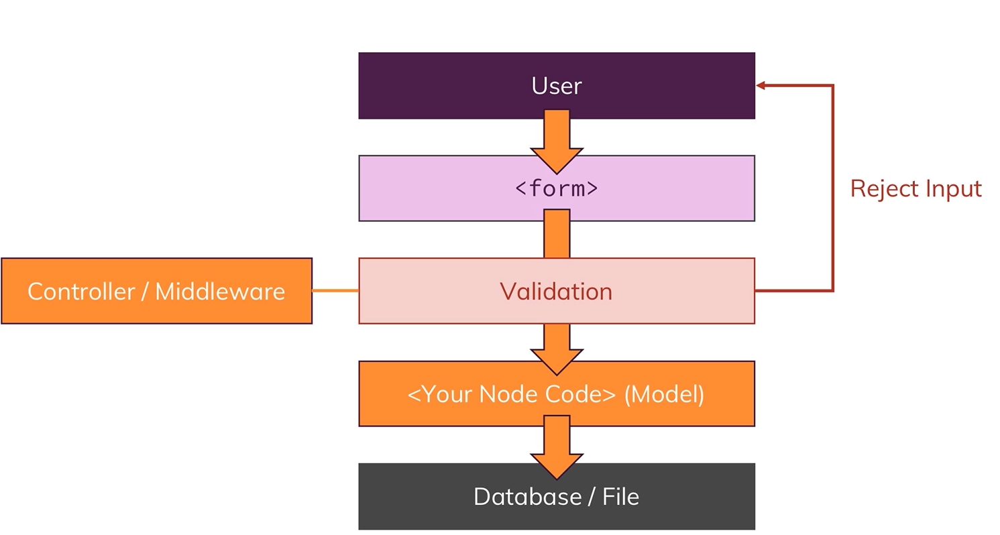

## Basics

# app.js file

- app.js or server.js is root file that makes our node js application
- In this we will create server
- run using node app.js
- There are core modules in nodejs (by default)
  - fs (file system)
  - path (helps in constructing path, paths to files or file system that work on any OS)
  - os (operating system)
  - http: (helpful when we create server & working with http requests & http responses); http helps with launching a server or sending requests (node app can send request to another server also, we can have multiple server communicate with each other)
  - https: helps in launching SSL encoded server
- require() is a way to import files in nodejs; it either takes file path or core module
- http: createServer method, it takes request listener as an argument; request listener is simply a function that will execute for every incoming request
- we will store http.createServer into const as server & listens it. listen() takes couple of argument 1st port, 2nd hostname etc
- process.exit() will de-register the createServer; It hard exit our event loop & therefore program shuts down

# Request & Response Headers

- On both requests and responses, Http headers are added to transport metadata from A to B.
- The following article provides a great overview of available headers and their role: https://developer.mozilla.org/en-US/docs/Web/HTTP/Headers

# Routing requets

- GET request is automatically sent when we click link or enter url
- POST request has to be set up by us by creating form

# Parsing requet bodies

- Incoming data is sent as stream of data that JS knows but JS doesn't
- 
- Buffer is a constrcut that allows us to hold multiple chunks & work with them before they are released once we are done

# Blocking & non blocking code

- fs.writeFileSync block code execution until file is created; even no incoming requests will be handled until file is completely created; It acceps the path & data as arguments
- fs.writeFile does not block the code execution; it takes 3rd argument also i.e a callback that should be executed when file creation is done

# Useful resources

- Official Node.js Docs: https://nodejs.org/en/docs/guides/
- Full Node.js Reference (for all core modules): https://nodejs.org/dist/latest/docs/api/
- More about the Node.js Event Loop: https://nodejs.org/en/docs/guides/event-loop-timers-and-nexttick/
- Blocking and Non-Blocking Code: https://nodejs.org/en/docs/guides/dont-block-the-event-loop/
