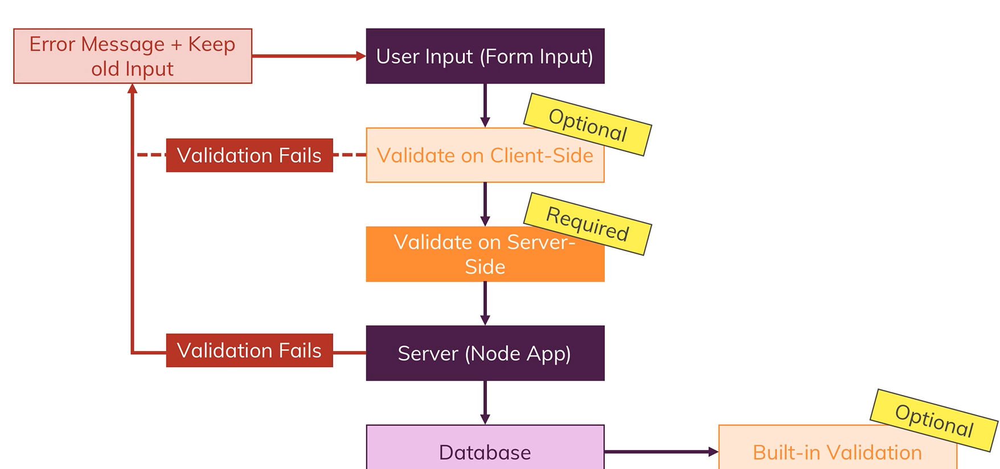

## Basics

# app.js file

- app.js or server.js is root file that makes our node js application
- In this we will create server
- run using node app.js
- There are core modules in nodejs (by default)
  - fs (file system)
  - path (helps in constructing path, paths to files or file system that work on any OS)
  - os (operating system)
  - http: (helpful when we create server & working with http requests & http responses); http helps with launching a server or sending requests (node app can send request to another server also, we can have multiple server communicate with each other)
  - https: helps in launching SSL encoded server
- require() is a way to import files in nodejs; it either takes file path or core module
- http: createServer method, it takes request listener as an argument; request listener is simply a function that will execute for every incoming request
- we will store http.createServer into const as server & listens it. listen() takes couple of argument 1st port, 2nd hostname etc
- process.exit() will de-register the createServer; It hard exit our event loop & therefore program shuts down

# Request & Response Headers

- On both requests and responses, Http headers are added to transport metadata from A to B.
- The following article provides a great overview of available headers and their role: https://developer.mozilla.org/en-US/docs/Web/HTTP/Headers

# Routing requets

- GET request is automatically sent when we click link or enter url
- POST request has to be set up by us by creating form

# Parsing requet bodies

- Incoming data is sent as stream of data that JS knows but JS doesn't
- 
- Buffer is a constrcut that allows us to hold multiple chunks & work with them before they are released once we are done

# Blocking & non blocking code

- fs.writeFileSync block code execution until file is created; even no incoming requests will be handled until file is completely created; It acceps the path & data as arguments
- fs.writeFile does not block the code execution; it takes 3rd argument also i.e a callback that should be executed when file creation is done

# Useful resources

- Official Node.js Docs: https://nodejs.org/en/docs/guides/
- Full Node.js Reference (for all core modules): https://nodejs.org/dist/latest/docs/api/
- More about the Node.js Event Loop: https://nodejs.org/en/docs/guides/event-loop-timers-and-nexttick/
- Blocking and Non-Blocking Code: https://nodejs.org/en/docs/guides/dont-block-the-event-loop/

# NPM scripts

- We can define some scripts in nodejs using npm
- npm init
- Set app.js as entry point file
- Add this to scipts in package.json : "start": "node app.js" (start is special reserved keyword) - npm stast is same as npm run start because start is reserved keyword for this
- If we add another "start-server": "node app.js" - for this we have: npm run start-server not npm start-server

# Installing 3 party packages (nodemon)

- 
- After making changes to our code we save it, exit the terminal & restart the server to see changes
- To get instant changes without quitting the server we install 3rd party 'nodemon'
- npm i nodemon --save-dev
- We wil change the start script from node app.js to nodemon app.js

# Global, core & 2rd party modeules

- Global Features vs Core Modules vs Third-Party Modules
  - Global features: Keywords like const or function but also some global objects like process
  - Core Node.js Modules: Examples would be the file-system module ("fs"), the path module ("path") or the Http module ("http")
  - Third-party Modules: Installed via npm install - we can add any kind of feature to our app via this way
    - Global features are always available, we don't need to import them into the files where we want to use them.
    - Core Node.js Modules don't need to be installed (NO npm install is required) but we need to import them when we want to use features exposed by them. Example:
      - const fs = require('fs');
      - We can now use the fs object exported by the "fs" module.
    - Third-party Modules need to be installed (via npm install in the project folder) AND imported. Example:
      - npm install --save express-session
      - In code file (e.g. app.js)
      - const sessions = require('express-session');

# Type of Errors

- Syntax Errors: If we have typo in our code or we forget any closing curly bracket or anything
- Runtime Errors: When we try to execute some code which will just break when it runs
- Logical Errors: App just doesn't work the way it should, techincally a logical issue

# Debugging: https://code.visualstudio.com/docs/nodejs/nodejs-debugging

# Useful resources:

- More on debugging Node.js: https://nodejs.org/en/docs/guides/debugging-getting-started/
- Debugging Node in Visual Studio Code: https://code.visualstudio.com/docs/nodejs/nodejs-debugging

## Express.js

- Nodejs framework
- npm i --save express
- Expressjs is all about middleware i.e an incoming request is automatically funneled through bunch of functions by expressjs
- 
- use function of express() allows us to add new middleware function. It accepts array of request handlers
- We can pass function inside use(), it take 3 arguments: req, res, next; next is a function that will be passed to this function by express

# handling routes

- We can add route path at the beginning of use()

# Parsing incoming reequests

- by default request doesn't try to parse the incoming request body, therefore we need to register parser
- Express by default used to have body-aprser pckg inside it, then they removed & then again re-added, but we will install it
- npm i --save body-parser
- bodyParser.urlencoded({ extended: false }) registers a middleware; { extended: false } to set confg , to enable bodyparser
- app.get() will get fored for only incoming requests
